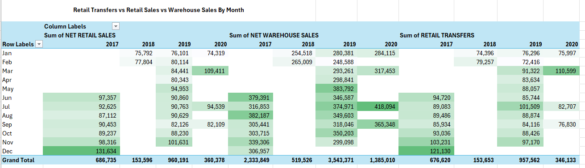
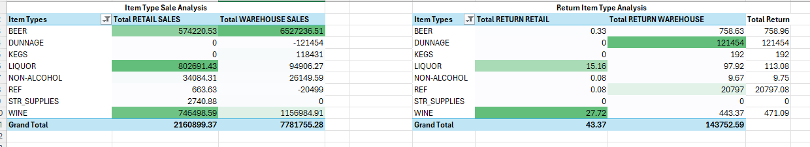
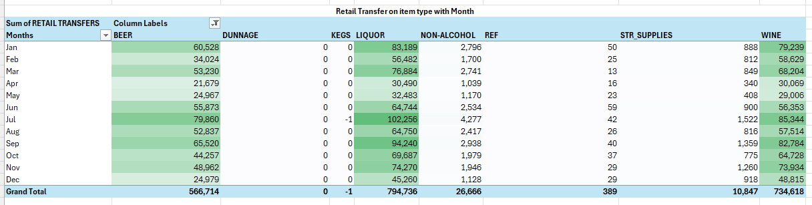
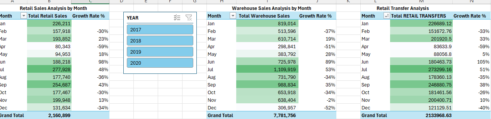

# Warehouse_Retail_Sales
Excel project of warehouse and retail sales analysis

## Project Background
Warehouse and Retail Sales is sourced from multiple retail chains and warehouse distribution centers, including sales transactions, inventory updates, and product details.

## Executive Summary
Warehouse and Retail Sales analysis of **308K** data placed between 2017 and 2020. Most of the company’s revenue with **9.94 Million**, comes from the 
warehouse channel, which makes up **78% of total sales**, while retail sales contribute **22%** . Across both channels, total sales of returns are minimal,
showing that products are well-matched to customer needs and operations are running smoothly. With 9 item types and an **average of 6.94 retail transfers**
per item.

## Insights Deep-Dive

### Monthly Analysis
Retail Sales shows highest performance in 2019 with **over 960K** , driven by strong monthly figures in *March, July, and November*. 
While **2017** also performed well, **2018 and 2020** were weaker, may be lack of sufficient data to retrieve and possibly due to market conditions or 
reduced activity.

- Warehouse Sales totaled at *3.54 Million*, showing a strong baseline especially in 2019. Like retail sales, insucfficient data or other possible 
reasons effect sales in 2018 and 2020. 
- Since 2020 decline is likely linked to COVID-19's impact on logistics, staffing, and customer demand.
- The more number of retail transfers are likely affect in sales of retail or warehouse especially during *March, July and December seasonal*.

### Item Sales
Retail channel contributes **$2.16M (22% of total revenue)**. Warehouse channel contributes **$7.78M (78% of total revenue)**, confirming it as the primary revenue stream.
- Beer, Liquor, and Wine dominate sales across both channels, contributing over **90% of total revenue**.
	- Beer alone generates $6.5M in warehouse and *$574K in retail*, making it the top-selling product overall.
	- Liquor is the most retail sales with *$802.7K*, while also contributing nearly $95K in warehouse sales.
	- Wine performs strongly in both channels, with *$746.5K retail and $1.15M warehouse*, showing balanced demand.

- Dunnage and REF report negative warehouse sales (−$121K and −$20K respectively), suggesting high return volumes or internal adjustments.
- Non-Alcohol items contribute modestly across both channels, totaling just *over $60K*, with consistent but minimal impact.

- Dunnage (84% of total warehouse returns) and REF (14% of warehouse returns). These categories likely relate to packaging, transportation, or equipment handling — not product defects
- Though volumes are small, Liquor (27.7 units) and Wine (15.2 units) account for ~98% of retail returns. These returns may stem from customer dissatisfaction, breakage, or expiration.

### Retail Transfer on item type with Month								
The months of **January, March, July, and September** clearly show high retail transfers for *Beer, Liquor, and Wine*, which together account for over 85% of total retail transfers.

- Liquor is consistently high throughout the year, rarely dropping below 60K monthly units. This implies stable and strong consumer demand.
- Beer shows a fluctuating trend, peaking in **Jul (79.9K) and Sep (65.5K)**, and dipping in Apr and Dec. This may suggest seasonal consumption, especially for summer events or gatherings.
- Wine remains consistently strong, peaking in July, Sep, and Jan, likely aligning with celebratory periods like New Year, summer parties seasons.

### Growth rate analysis

#### Retail Performance
**Total Retail Sales:** $2.16M  
**Strongest months:** July ($278K), January ($226K), and September ($255K), together contributing ~36% of total sales.  
June showed a 98% growth spike, indicating strong mid-year promotional activity or restocking patterns.  
April and December marked the lowest sales months, dropping by 59% and 34%, respectively, potentially due to post-holiday fatigue or off-season demand.

#### Warehouse Performance
**Total Warehouse Sales:** $7.78M  
Warehouse dominates with *78% of total sales volume*.  
July was the peak month at $1.1M, followed by January and September, signaling bulk procurement cycles tied to start-of-year and mid-year events.  
December plunged 52%, highlighting a significant year-end slowdown, possibly due to prior inventory buildup or budget exhaustion.

#### Retail Transfers
**Total Transfers:** 2.13M units  
**Peak months:** July (273K), January (227K) and September (247K) — strongly aligned with Retail and Warehouse peaks.  
June saw a 105% increase, mirroring the spike in retail sales, suggesting efficient inventory movement from warehouse to point-of-sale.  
December again showed the weakest performance, falling 40%, highlighting a consistent drop across all channels.

## Recommendations
Seasonal trends are visible, with *December and March* showing repeated sales peaks, suggesting opportunities for targeted promotions during those months.  
Explore why *March* sees a drop after strong early-year sales — consider extending promotions or adjusting pricing strategies *post-February*.  
Plan major promotions around January, March, July, and September, when retail transfers and sales are strongest.  
Investigate reasons for higher returns in Liquor, Wine (retail) and Dunnage, REF (warehouse) to improve product handling or customer satisfaction.  
Strengthen data tracking for all years to ensure future analysis is more accurate and insightful.

## Conclusion
The company's revenue is largely driven by the **warehouse channel**, contributing **78% of total sales**.  
**Beer, Liquor, and Wine** stand out as the most successful item types across both retail and warehouse.  
Retail transfers play a key role in supporting sales, especially during January, March, July, and September.  
While 2019 showed strong retail and warehouse performance, 2018 and 2020 lagged behind, likely due to data gaps and the impact of external factors like COVID-19.  
Returns are minimal, indicating good product-market fit and operational efficiency.
